```{r}
#| label = "setup",
#| include = FALSE
options(htmltools.dir.version = FALSE)
knitr::opts_chunk$set(warning = FALSE, message = FALSE, 
  comment = NA, dpi = 300,
  fig.align = "center", out.width = "80%", cache = FALSE)
library(tidyverse)
library(babynames)
```

## Overview


-   Goals and Expectations


-   Course Structure


-   Course Policies

# Goals and Expectations  {.inverse}

## What you will learn

You will learn

-   how to think like a social scientist


-   how to use data to make descriptive, predictive, and causal claims


-   how to quantify uncertainty about these claims


-   how to present, interpret, and critique these claims

## Reasons to take this class {.incremental}

1.  You want to change the world

. . .


##  {background-image="images/nyt.png" background-size="contain"}

##  {background-image="images/pnas-1.png" background-size="contain"}

##  {background-image="images/pnas-2.png" background-size="contain"}

## Why is this study important?

-   Findings provide evidence of benefits of social spending/universal basic income

## Why should we believe these results

::: incremental
-   Because it's in the *Times*?

-   Because the authors are professors at *good* schools?

-   Because of how the study was done!

    -   **Random assignment** provides a reasoned basis for inference
    -   Creates informative **counter-factual comparisons**
    -   **Pre-registered hypotheses** ensure that we're not cherry-picking results
:::

## Why might we be skeptical of these results?

::: incremental
-   How strong are the effects?
    -   Is a fifth of a standard deviation a lot?
-   Why do we care about brain waves?
-   What's the mechanism?
-   How confident are we that these results couldn't have happened just by chance
:::

## Why might we be skeptical of these results?

```{r}
#| echo = F,
#| out.width = 500
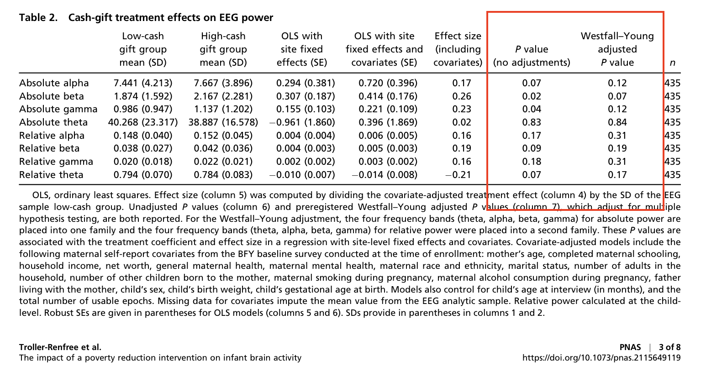
```

## Why might we be skeptical of these results?


Source: [Andrew Gelman](https://statmodeling.stat.columbia.edu/)

## Why might we be skeptical of these results?


Source: [Andrew Gelman](https://statmodeling.stat.columbia.edu/)


## Why might we be skeptical of these results?

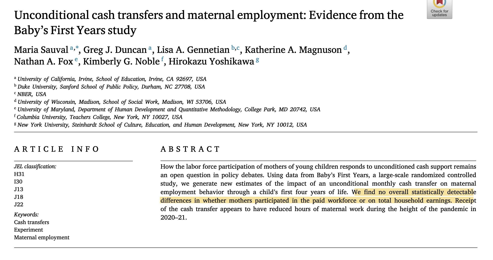

## Why might we be skeptical of these results?

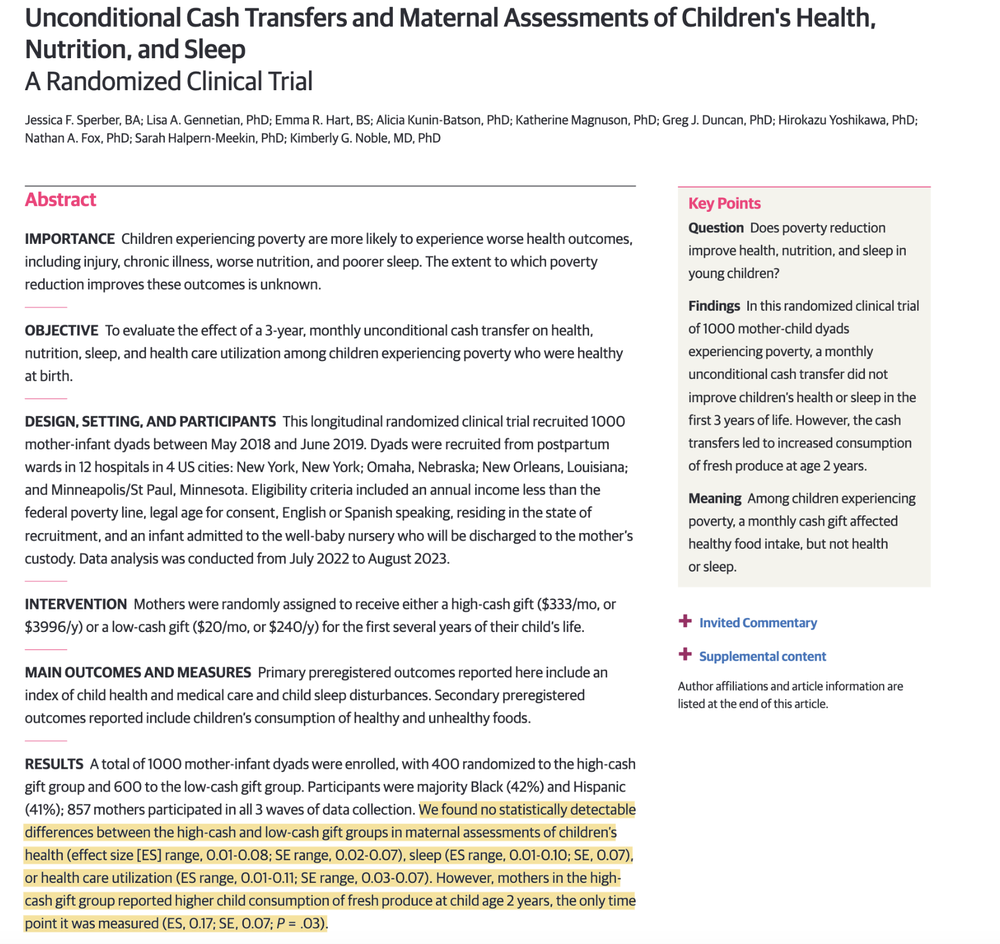

## Reasons to take this class

-   You want to change the world

    -   Data, design, and analysis are incredlibly powerful tools
    -   You want to understand their strengths and limits

-   You want to be a better consumer of data and knowledge

-   You want to get a job / go to grad school

-   You *have* to

##  Expectations

I expect that you will come to class ready to engage with:

-   social science

-   data

-   programming

-   math

## Requirements

I assume that you will

::: fragment
1.  Do the readings
:::

::: fragment
2.  Bring your computers [^1]
:::

[^1]: If you only have a desktop/or tablet let me know and we'll figure out a solution.

::: fragment
3.  Work through classwork
:::

::: fragment
4.  Ask questions
:::


# Course structure {.inverse}

## Class

-   Monday and Wednesday: Lecture/Demonstration (and start lab if time permits)

-   Friday: Lab/Hands-on with R

## Class websites

-   Slides, labs and additional resources available here: [Pols 1600 Site](https://josephessig-source.github.io/pols1600_site/)

-   Assignments uploaded here: [Canvas](https://canvas.brown.edu/courses/1102109)

## Software and computing

-   Statistics done using R
    -   Open source (free) statistical language
-   Through R Studio
    -   An integrated development environment for R
-   Results written up using R Markdown
    -   Language for combing R code with html Markdown


## R


## R Studio

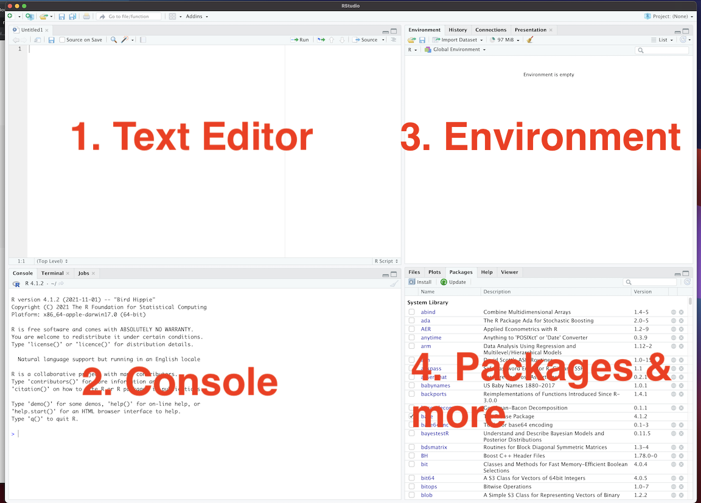

## Quarto

::: columns
::: {.column width="\"40%"}
-   Project options in YAML
-   Code in triple backtick chunks:
    -   Chunk options set with "#\|" (hashpipe)

```{{r}}
#| label = "simulate_data"
x <- rnorm(100)
y <- 2*x + rnorm(100)
```

-   Write up in [Markdown](https://www.markdownguide.org/)

-   Output rendered as an html file
:::

::: {.column width="\"40%"}

:::
:::

## Getting set up for the course:

Here's a [link to a guide](../resources/00-software-setup.qmd) to get you setup for the course.

Take a crack at it after class. 

Email me with any issues (there are always issues), and we will get everyone up to speed on Friday. 

## Textbook

```{r}
#| echo = F,
#| out.width = "40%"
knitr::include_graphics("https://pup-assets.imgix.net/onix/images/9780691222288.jpg?w=1500&auto=format")
```

<https://press.princeton.edu/books/paperback/9780691222288/quantitative-social-science>

## How to Read Imai

-   Active reading

-   Copy and run the code in the text. To do so, do the following:

```{r}
#| eval: false
#| echo: true
if (!require("devtools")){
  install.packages("devtools")
  }
library("devtools")
install_github("kosukeimai/qss-package",  
               build_vignettes  =  TRUE)
```

## How to Read Imai

Once you've run the following

```{r}
#| eval: false
#| echo: true
install.packages("devtools")
install.packages("remotes")
remotes::install_github("kosukeimai/qss-package", build_vignettes = TRUE)
```

Anywhere the text loads data:

```{r}
#| eval: false
#| echo: true
afghan <- read_csv("afgahn.csv")
```

You can do

```{r}
#| echo: true
library("qss")
data("afghan")
summary(afghan$age)
```

## Additional Readings

-   Occasionally, I will provide additional readings, available on both Canvas and the course website (under the Class tab). 

# Assignments  {.inverse}

## Assignments

You have three types of assignments in this course

-   Labs
-   Tutorials
-   Final Project

## Labs

-   Each Friday we will work in groups to complete an in-class lab
-   The labs are designed to reinforce and extend concepts from lecture using real world data.

## Labs

```{r}
#| echo = F,
#| out.width = 500
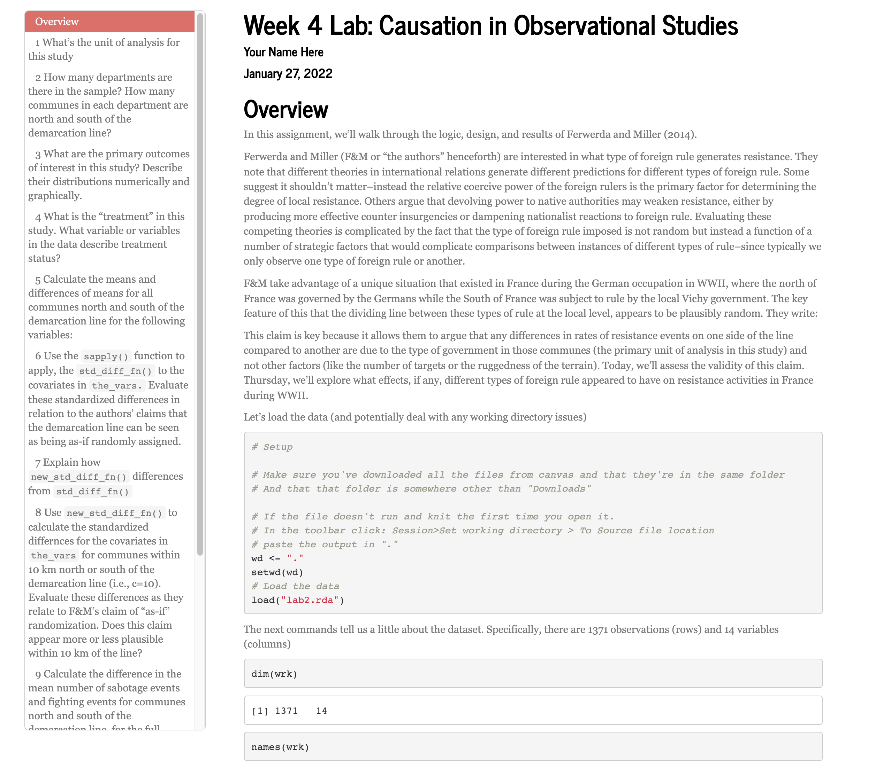
```

## Labs

```{r}
#| echo = F,
#| out.width = 500
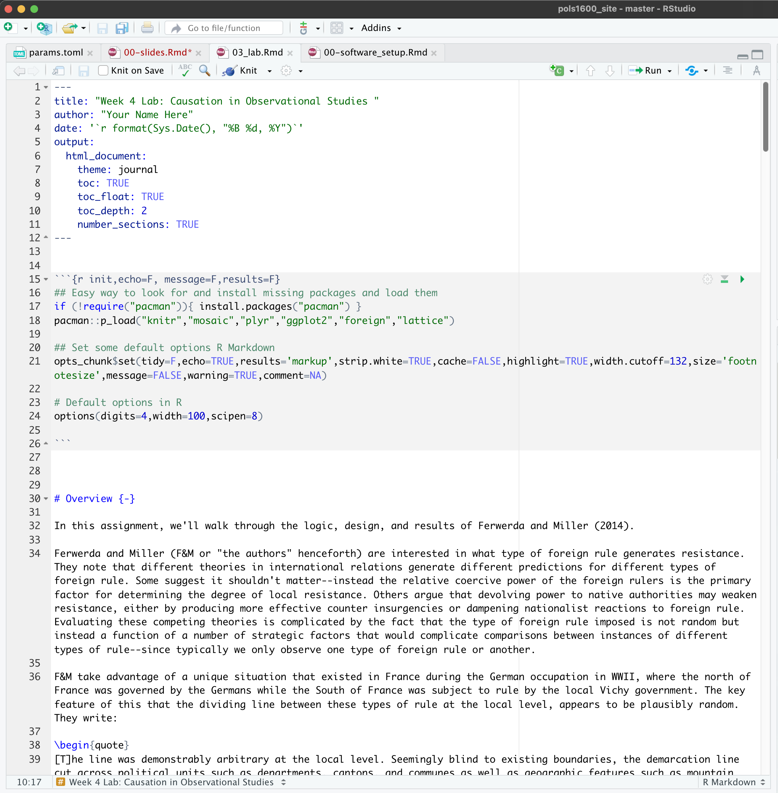
```

## Labs

-   Weeks 1 and 2 we'll work collectively
-   Weeks 3 on, you'll be assigned to small groups
-   Each week:
    -   Log on to the Canvas, download the lab .qmd file
    -   Open R Studio
    -   Render the qmd file to get ready to work
    -   Complete the lab
    -   Upload the rendered html file to Canvas by the end of class
-   One question randomly graded
    -   100% if correct
    -   85% if incorrect, but you tried
    -   0% if you did not try/absent for the lab
-   Comments/Answers posted immediately after class

## Problem Sets/Tutorials

-   Coding tutorials to reinforce concepts from lecture and textbook.
-   Accessed by running

```{r}
#| eval = F
learnr::run_tutorial("00-intro", package = "qsslearnr")
```

-   Complete the tutorial. Save output as "LASTNAME_TutorialNumber.pdf"
-   Upload output to Canvas by the following Monday by 11:59 pm (Due date always posted in canvas)
-   Grades:
    -   100% any upload
    -   0% no upload

## Final Project

## Your First Assignment:

-   Download and install R and R Studio
    -   Email me if you have troubles
    -   Troubleshoot by Zoom or in-person 
-   Work through [00-software_setup](../resources/00-software-setup.qmd) before next class.

## Making Mistakes

-   To err is human! 
-   Making mistakes is part of learning, even if it is frustrating. 
-   Working through problems = improving. 

## Final Reports

-   Can be on any topic you like
-   More info to come
-   Due dates:
    -   Week 3 Groups assigned
    -   Week 4 Research Topics
    -   Week 6 Data Proposal
    -   Week 8 Data Explorations
    -   Week 11 Drafts
    -   Week 12 Presentations
    -   Week 13 Final Paper

# Grading and Other Policies  {.inverse}


## Grading

-   5% Attendance
-   10% Class involvement and participation
-   10% Tutorials
-   30% Labs
-   20% Assignments for final paper
-   25% Final paper

## Grading

- Labs: Check-plus (100), Check (85), no credit (0).
  + Two lowest labs dropped 
  
- Tutorials: Pass (100%) or No Credit (not submitted) (0%).
  +If late, max credit = 50%. (Due date always posted in canvas assignments)
  
  - Assignments: % out of 100. (Due date always posted in canvas sssignments)

## Course policies

- Attendance: Please come to class. After first 2 absences, lose 1% out of 5% possible for attendance, unless excused. 

- Academic Integrity: See the syllabus and refer to the academic code.

- Generative AI: Discouraged, but if you use it, must be disclosed.(It doesn't replace your own effort and thinking)

- If you don't disclose, this is a violation of the academic code. 

- If you choose to use GenAI, you are responsible for its output, and will be graded accordingly. 

## What does quantitative research do?

-   Descriptions

## Descriptions

```{r}
#| echo = F,
#| out.width = 500
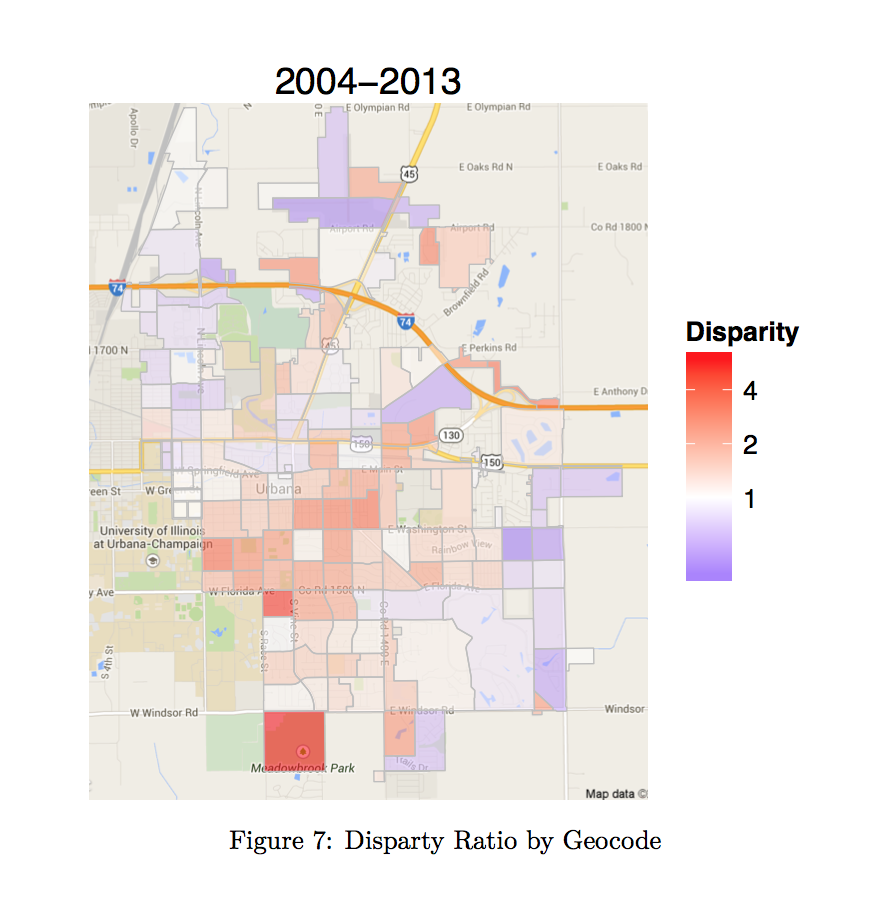
```

## What does quantitative research do?

-   Descriptions
-   Explanations

## Explanations

```{r}
#| echo = F,
#| out.width = 500
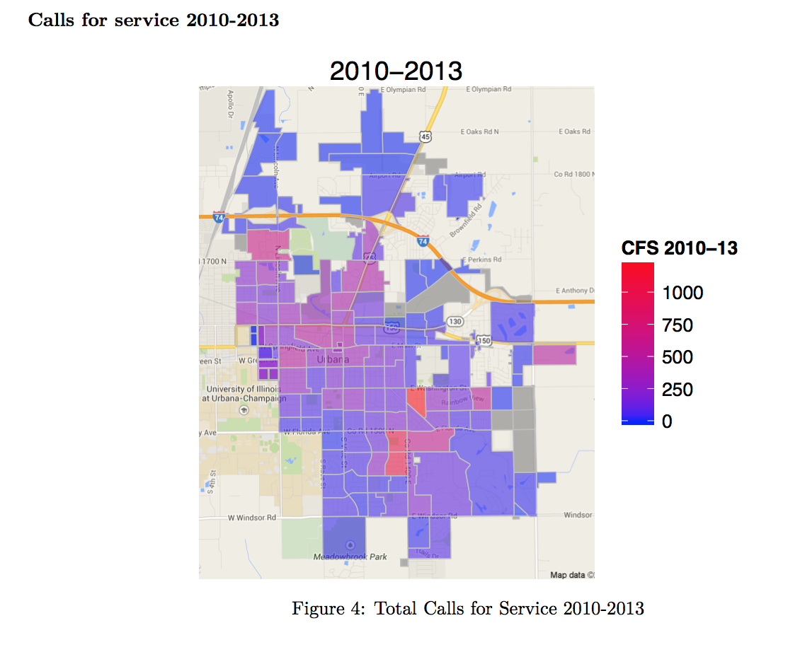
```

## Explanations

```{r}
#| echo = F,
#| out.width = 600
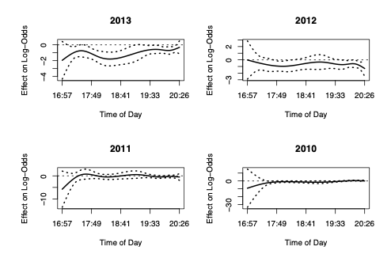
```

## What does quantitative research do?

-   Descriptions
-   Explanations
-   Predictions and Uncertainty

## Predictions and Uncertainty

```{r}
#| echo = F,
#| out.width = 500
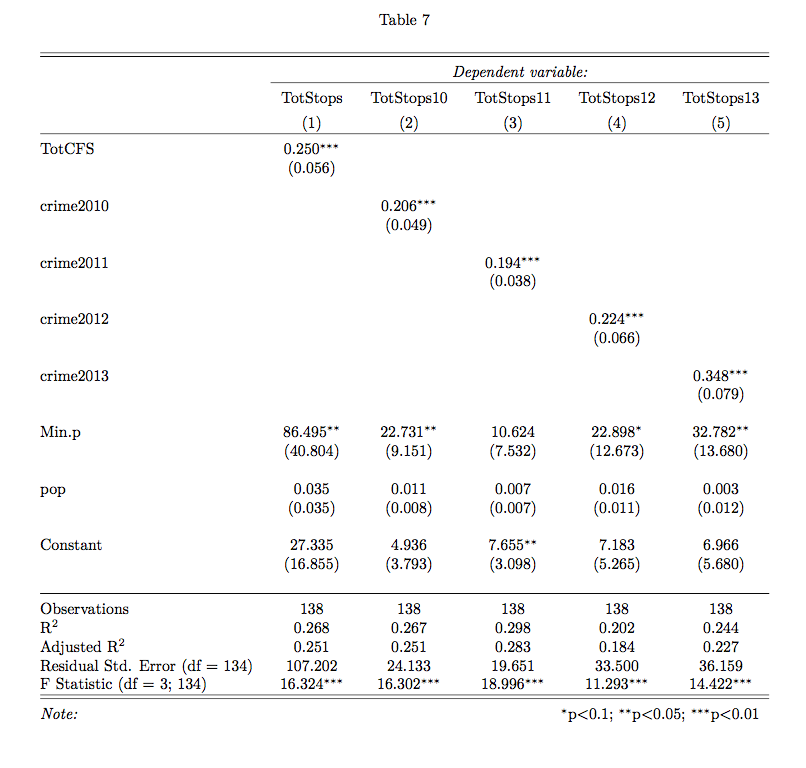
```

## Predictions and Uncertainty

```{r}
#| echo = F,
#| out.width = 400
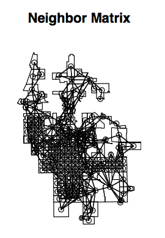
```

## Predictions and Uncertainty

```{r}
#| echo = F,
#| out.width = 450
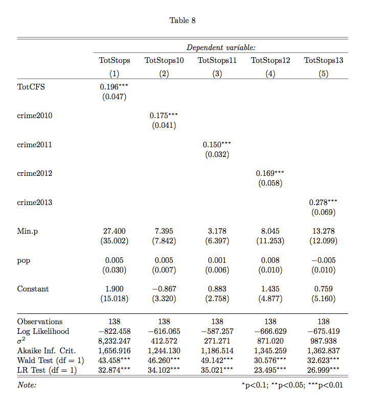
```

## What does quantitative research do?

-   Descriptions
-   Explanations
-   Predictions and Uncertainty

## 


## Next Time:

-   Complete the class survey, which will be sent out in a canvas announcement. 
-   On Friday, we will make sure everyone has [Downloaded and Installed R and R studio](https://josephessig-source.github.io/pols1600_site/resources/00-software-setup.html)
